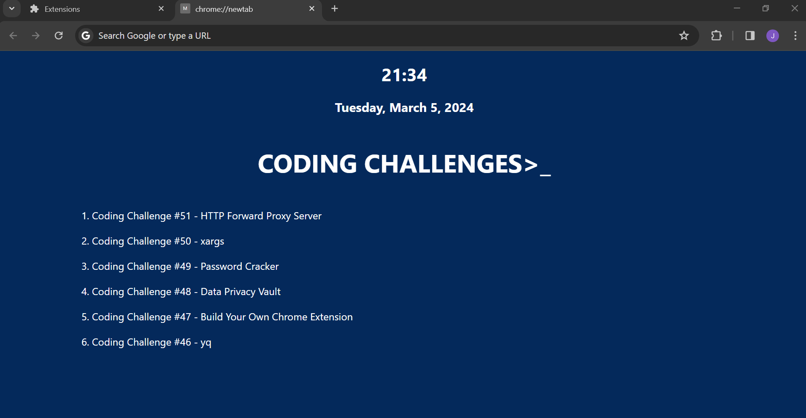

# Build Your Own Chrome Extension

## What is Chrome Extension?
Chrome extensions are a software programs that extends the functionality of the Google Chrome web browser. They are typically written in HTML, CSS, and JavaScript, and they modify or enhance the browser’s functionality in some way.

## The Challenge - Building A Chrome Extension
For this Coding Challenge you’re going to build a Chrome extension that will customise the look and functionality of each new tab you open in Chrome. It’s drawing on inspiration from the popular extension [Bonjourr](https://chromewebstore.google.com/detail/laookkfknpbbblfpciffpaejjkokdgca?hl=en) and the more complicated [Momentum](https://chromewebstore.google.com/detail/bonjourr-%C2%B7-minimalist-sta/dlnejlppicbjfcfcedcflplfjajinajd).

If you’ve never built a Chrome extension before the Chrome for Developer website has a section on [getting started](https://developer.chrome.com/docs/extensions/get-started) building Chrome extensions.

**Source:** [Coding Challenge by John Crickett](https://codingchallenges.fyi/challenges/challenge-chrome-extension)

## Demo

This is the output of my solution.

