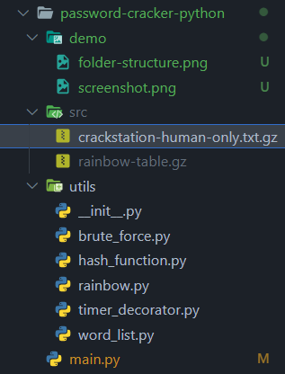
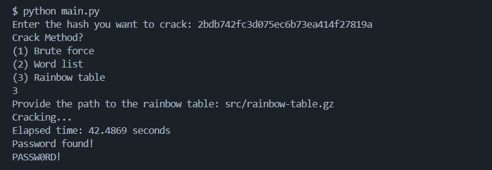

# Build Your Own Password Cracker

## Project Summary

This project aims to address the evolution of password security measures and the challenges posed by common password patterns and dictionary attacks. Historically, plaintext storage of passwords led to vulnerabilities, prompting the adoption of hash functions for password obfuscation. However, with the rise of common password patterns and faster computing, brute-force and dictionary attacks became prevalent. To counteract these threats, the use of complex hashes, longer passwords with varied characters, and salting techniques were introduced. 

This project explores password cracking techniques, emphasizing the importance of robust security measures in multi-user systems.

Source: [Coding Challenge by John Crickett](https://codingchallenges.fyi/challenges/challenge-password-cracker/)


## Launching the Program

To launch the password cracker program, follow these steps:

**Step 1. Download the word list:**

Before proceeding, go to [CrackStation](https://crackstation.net/crackstation-wordlist-password-cracking-dictionary.htm) and download the **Smaller Wordlist**.


**Step 2. Navigate to the project folder:**

Open your terminal and change into the project folder:

```bash
cd password-cracker-python
```


**Step 3. Run the Python script to launch the program:**

Once you're inside the `password-cracker-python` folder, execute the following command:

```bash
python main.py
```

This command will execute the main Python script named `main.py` and launch the password cracker program.

**Step 4. Follow the on-screen instructions to use the program:**

After running the `main.py` script, the password cracker program should start, and you'll be prompted to input the necessary information or follow the program's instructions to crack passwords.

**Step 5. (Optional) Create a rainbow table:**

If you wish to create a rainbow table using the program, make sure you have a word list file written in bytes under `src` folder, as shown in the screenshot:



And run the following command:

```bash
python -m utils/rainbow.py
```

## Demo

This is how the program looks like when in action.



